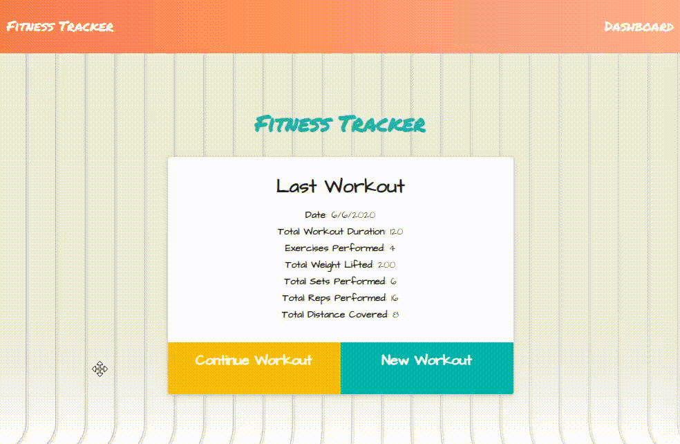

# Fitness Traker      
### Homework - 17 / Mongoose with mongoDB

- Link to Deploy app, at the end. [>> GO ⬇️ <<](#url)



- App functionality


## 📌Table of Content

* [Description](#description)
* [Installation](#installation)
* [Usage](#usage)
* [Test](#test)
* [Contributing](#contributing)
* [License](#license)
* [Details](#details)
* [Features](#features)
* [URL](#url)
* [Questions](#questions)

## 📋Description
"Fitness" is a web application that can help you keep track of your workout plan more organize. Powered by mongoDB and javascript you can see the workouts with all your exercise plus the stats (from the database).

- Open the application using "command line", (recomended: GitBash).


## 💿Installation
    1. Install node.js  
    2. Clone the repository
    3. npm install

## ▶️Usage
Open the server app using ```node server ``` in your terminal (root repo).   

## 📊Test
 ```
 npm run test (None).
 ```


## 🤝Contributing
Feel free to pull request and give me your suggestions if any.
          
## ⚖️License  
This project is under the MIT License.

## 📑Details

This repository content the files: JavaScript "server.js" (main app), Mit license"LICENSE.txt", "package.json", "package-lock.json", models, node_modules", config, routes, seeds, public, views folder and an "images" folder with the captures and gifs for this Readme File.

## 🔗URL  

- Check my Demos on my Youtube page "https://www.youtube.com/channel/UCev6xJU1FGx1IbRjQhtjKcQ"
- The URL to this repo page is "https://github.com/diegolehyt/homework17.git"
- Deploy App on Heroku page Here! --> "https://arcane-retreat-10341.herokuapp.com/" <--

## 👤Questions  
       


✉️ E-mail: diegolehy00@gmail.com

